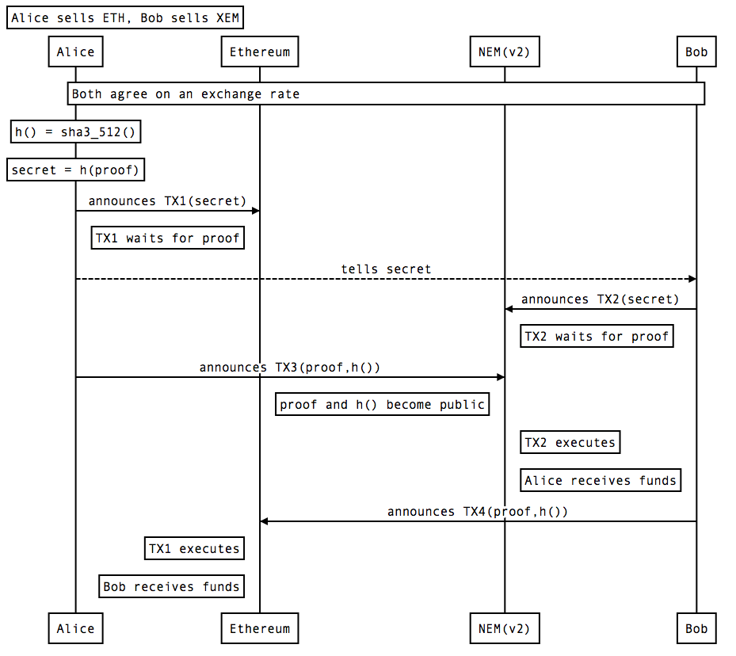

# README

This Ethereum smart contract demonstrates an 'Atomic cross-chain swap between different blockchain networks' and is based on the NEM cross-chain swap functionality. 
The blockchains needs to support *Hashed TimeLock Contract* or [HTLC](https://en.bitcoin.it/wiki/Hashed_Timelock_Contracts) for a trustless environment for swaps. In NEM Blockchain these are described as 'secret lock' and 'secret proof' functionalities. It's possible with Ethereum, Bitcoin, NEM, NEO and several other protocols.

- [NEM Developer Center Concepts](https://nemtech.github.io/concepts/cross-chain-transaction.html)
- [NEM Developer Center Guides](https://nemtech.github.io/guides/transaction/atomic-cross-chain-swap-between-NEM-public-and-private-chain.html)
- [Bitcoin Atomic cross-chain trading](https://en.bitcoin.it/wiki/Atomic_cross-chain_trading)

However, whether it is real 'Atomic' is a valid point to discuss. Nevertheless both parties have a strong incentive to fullfill the rules.

## How it works

Lets say Alice wants to convert ETH to NEM:XEM and Bob NEM:XEM to Ether. 

The steps required are illustrated in the diagram below. 

|    |     Transaction | Network | Sender | 
|----------:|:---------------:|:-----:|:--:| 
| TX1 |  **secretLock**(uint256 _lockTimeSec, bytes32 _hash, address _recipient) |  Ethereum Rinkeby Testnet | Alice | 
| TX2 |    **SecretLockTransaction**.create(Deadline.create(), new Mosaic(new MosaicId('nem:xem'), exchangeValue), lockTime, HashType.SHA3_512, secret, aliceNEM.address, NetworkType.MIJIN_TEST) |  NEM Catapult Private Chain | Bob | 
| TX3 | **SecretProofTransaction**.create( Deadline.create(), HashType.SHA3_512, secret, proof, NetworkType.MIJIN_TEST) | NEM Catapult Private Chain | Alice | 
| TX4 | **secretProof**(bytes32 _hash, bytes _proof) |  Ethereum Rinkeby Testnet | Bob | 

Hint: Note that the wording in this Ethereum smart contract is a bit different as in the NEM documentation. For some, the NEM naming can be confusing, because `secret` represents a `hash` of a `proof`. However, consider that the hashing algorithm also needs to be revealed for the swap to work and that's why it could be confused with the *hash* term.

## Notes
Web3 version 1.x is installed with NPM. Also Truffle comes with Web3 0.2x. The API of these Web3 are not always compatible. 
- [Web3 version 1.x](https://github.com/ethereum/wiki/wiki/JavaScript-API)
- [Web3 version 0.2x.x](https://github.com/ethereum/wiki/wiki/JavaScript-API#web3-javascript-app-api-for-02xx)
